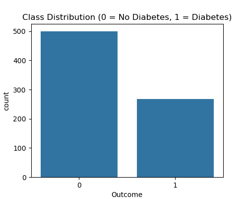
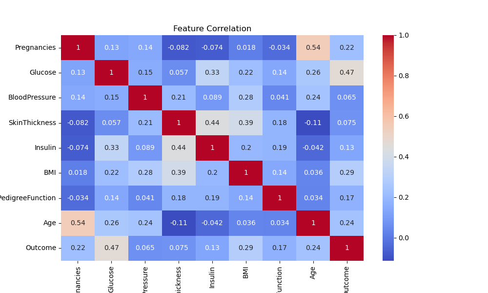
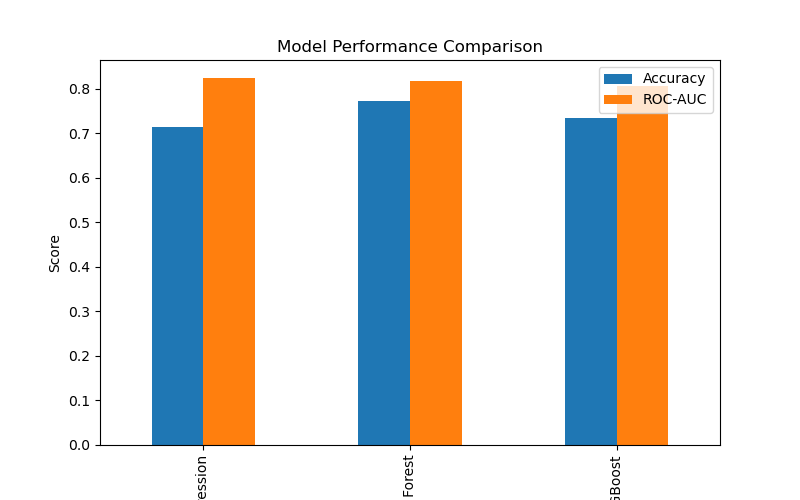
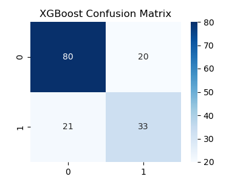
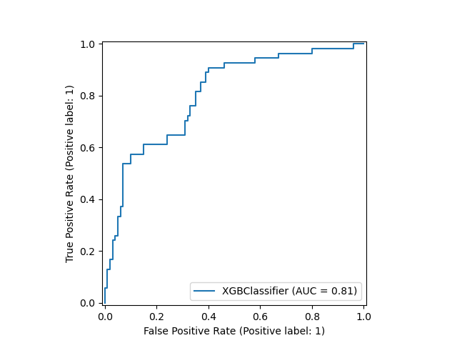

# 🩺 Disease Prediction using Machine Learning - Python

This project was completed as part of my **Machine Learning Internship** at **CodeAlpha** (Task 01).
The objective of this task was to build a **Disease Prediction Model** (using the Kaggle Diabetes dataset) to identify whether a patient is likely to have diabetes based on medical data.

---

## 📌 Task Objective

Develop a **classification-based ML model** that:

* Predicts the likelihood of diabetes.
* Uses patient attributes like age, glucose, BMI, pregnancies, etc.
* Applies **Logistic Regression, Random Forest, and XGBoost**.
* Evaluates models using **Accuracy, Precision, Recall, F1-score, ROC–AUC**.
* Visualizes performance with **Confusion Matrices, Model Comparison, and ROC Curve**.

---

## 🛠️ Technologies Used

* **Python 3**
* **Pandas, NumPy** – data preprocessing
* **Matplotlib, Seaborn** – visualizations
* **Scikit-learn** – Logistic Regression, Random Forest
* **XGBoost** – boosting classifier

---

## 📁 Project Structure

```
CodeAlpha_DiseasePrediction/
├── Disease-Prediction.ipynb      # Jupyter Notebook (EDA → Models → Results)
├── README.md                     # Project documentation
├── class_distribution.png        # Saved graphs
├── correlation_heatmap.png
├── model_comparison.png
├── XGBoost_confusion_matrix.png
│── roc_curve_xgboost.png
└── diabetes.csv
```

---

## 🧾 Features

* **EDA** – Class balance, correlation heatmap, feature analysis.
* **Model Training** – Logistic Regression, Random Forest, XGBoost.
* **Evaluation** – Accuracy, Precision, Recall, F1-score, ROC–AUC.
* **Visuals** – Model comparison, confusion matrix, ROC curve.

---

## 🖼️ Results & Screenshots

### Class Distribution



### Correlation Heatmap



### Model Comparison



### Confusion Matrix (XGBoost)



### ROC Curve (XGBoost)



---

## 🖥️ How to Run

1. **Clone the Repository**

   ```bash
   git clone https://github.com/your-username/CodeAlpha_DiseasePrediction.git
   cd CodeAlpha_DiseasePrediction
   ```

2. **Install Dependencies**

   ```bash
   pip install -r requirements.txt
   ```

3. **Run Jupyter Notebook**

   ```bash
   jupyter notebook Disease-Prediction.ipynb
   ```

---

## 🔧 Future Enhancements

* Add **hyperparameter tuning** (GridSearchCV/Optuna).
* Handle **class imbalance** (SMOTE, class weights).
* Use **SHAP/Explainable AI** for model interpretability.
* Build a **Streamlit app** for interactive predictions.

---

## 🎓 Internship & Task Details

* **Internship Track:** Machine Learning
* **Provider:** CodeAlpha
* **Task ID:** Task 01
* **Task Name:** Disease Prediction Model
* **Environment:** Kaggle Notebook / Jupyter Notebook

---

## 📬 Contact

* **Name:** Difina George
* 📧 **Email:** [difina.georgecs@gmail.com](mailto:difina.georgecs@gmail.com)
* 📍 **Location:** Kerala, India
